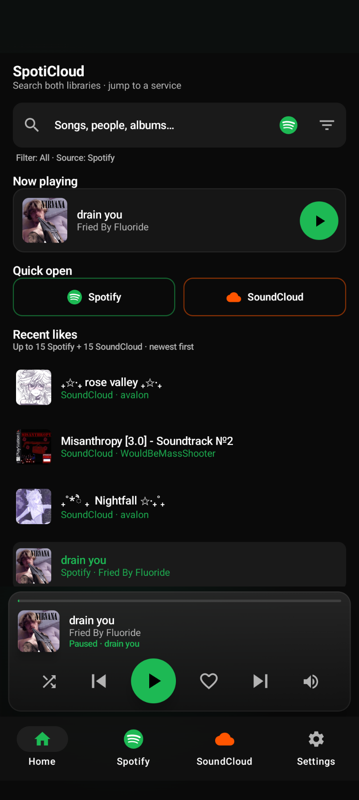
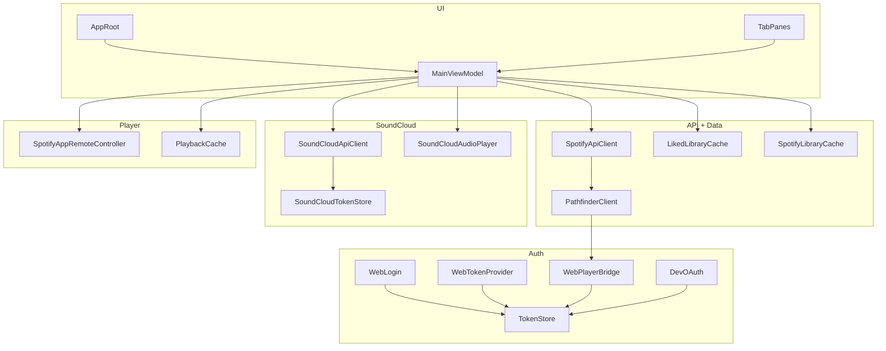

# SpotiCloud

SpotiCloud is an Android APK that puts **Spotify** and **SoundCloud** in one app. Spotify playback needs **Premium** plus the **Spotify app** on the phone. SoundCloud plays in-app.
This was inspired by the [SpiceCloud](https://github.com/5djr/SpiceCloud) repo by [5djr](https://github.com/5djr), and is a terrible reimagination of it on phone so go check that out for PC



> Unofficial. Not affiliated with Spotify or SoundCloud. Using unofficial sessions/tokens can break, get rate-limited, or risk account action — use carefully.

---

## Architecture



| Package | Role |
|---------|------|
| `ui/` | Compose shell (`AppRoot`, `TabPanes`) + `MainViewModel` |
| `auth/` | Spotify web `sp_dc` session, HOTP token, Pathfinder WebView bridge, optional Dev OAuth |
| `api/` | Pathfinder GraphQL facade + lyrics |
| `data/` | Models, disk caches, on-device secrets store |
| `player/` | Spotify App Remote, volume, last-now-playing cache |
| `soundcloud/` | API v2 client, OAuth store, stream resolve, ExoPlayer, like modes |

---

## Features

| Feature | Spotify | SoundCloud |
|---------|---------|------------|
| Login / session | In-app web login (`sp_dc`) | Paste OAuth + `client_id` (DevTools) |
| Home | Merged recent likes (up to 15 each) | Same |
| Search | Songs, people, albums (Pathfinder) | Songs, people, albums (api-v2) |
| Liked songs | Pathfinder + disk cache walkthrough | api-v2 likes + disk cache |
| Library | Playlists & albums | Likes, feed, playlists |
| Artist pages | Top tracks | Recent uploads |
| Playback | Spotify app via App Remote (Premium) | In-app ExoPlayer |
| Like / unlike | Pathfinder | WebView or API (+ captcha handling) |
| Lyrics | Expanded player | — |
| Secrets | Client ID in Settings (on-device) | Tokens on-device only |

---

## Installation

### Releases

published builds on GitHub: **[Releases](../../releases)** — download the latest APK and install (allow unknown sources).

### Build from source

**Requirements**

- [Android Studio](https://developer.android.com/studio) (JDK + SDK included)
- Android **8.0+** (API 26)
- For Spotify playback: **Premium** + official **Spotify** app installed
- Optional: Spotify Developer Dashboard app (Client ID) for App Remote / Dev token features

**Steps**

1. Clone this repo and open the folder in Android Studio  
2. Let Gradle sync finish  
3. **Run** on a device/emulator, or **Build → Build APK(s)**  

Debug APK output:

```
app/build/outputs/apk/debug/app-debug.apk
```

Secrets (Spotify Client ID, SoundCloud tokens) are **entered in the app** and stored on-device. Do not put them in `local.properties` or commit them.

Optional Spotify Dashboard (App Remote / Dev OAuth):

| Setting | Value |
|---------|--------|
| Package | `com.nexus.spotifydesktop` |
| Redirect URI | `com.nexus.spotifydesktop://callback` |
| SHA-1 | Your debug (or release) keystore fingerprint |

---

## Setup

On first launch (or when Spotify / SoundCloud credentials are missing), SpotiCloud shows a setup flow:

1. **Welcome** — risk agreement (unofficial APIs, ban risk, no liability) + **Setup**  
2. **Spotify** — log in with the in-app browser; optionally paste a Dashboard **Client ID** (saved on device)  
3. **SoundCloud** — paste **Client ID** + **OAuth** from your browser (no SoundCloud developer app required)

### SoundCloud credentials (desktop)

Same approach as [SpiceCloud](https://github.com/5djr/SpiceCloud):

1. Open [soundcloud.com](https://soundcloud.com) in a desktop browser and log in  
2. Open **DevTools** (`F12` / `Ctrl+Shift+I`) → **Network** tab  
3. Filter by `api-v2.soundcloud.com`, then **reload** the page so requests appear  
4. Click any XHR/fetch request to `api-v2.soundcloud.com`  
   - From the **request URL**, copy the value after `client_id=`  
5. In **Request Headers**, find **Authorization** and copy the value  
   - Looks like `OAuth 2-123456-…`  
   - Paste with or without the `OAuth ` prefix — both work  

Tokens expire after a few weeks; paste fresh ones when Connect fails.

**Settings → Re-setup** signs you out and runs the wizard again. Credentials stay on-device only.

---

## How the APIs work

### Spotify (`api/` + `auth/`)

- **Session:** unofficial web login captures `sp_dc` / cookies → short-lived access via HOTP (`WebTokenProvider`).  
- **Library / search / likes:** `PathfinderClient` talks to Spotify’s Pathfinder (api-partner) GraphQL through a hidden `WebPlayerBridge` WebView — same stack as open.spotify.com.  
- **Facade:** `SpotifyApiClient` wraps Pathfinder for the ViewModel; optional Developer OAuth can hit `/me/tracks` for testing.  
- **Playback:** not Connect Web API — `SpotifyAppRemoteController` drives the installed Spotify app (needs Client ID + Premium).  
- **Caches:** `LikedLibraryCache` / `SpotifyLibraryCache` soft-start from disk and head-compare before full refetch (avoids 429 storms).

### SoundCloud (`soundcloud/`)

- **Auth:** user-pasted OAuth token + anonymous-style `client_id`, stored in `SoundCloudTokenStore`.  
- **API:** `SoundCloudApiClient` calls `api-v2.soundcloud.com` (search, likes, feed, playlists, stream resolve).  
- **Playback:** resolve progressive / HLS URL → `SoundCloudAudioPlayer` (ExoPlayer).  
- **Likes:** WebView track page (safer) or API like (may hit DataDome / CAPTCHA).

---

## Limitations

- Spotify audio requires **Premium** and the **Spotify mobile app**  
- Spotify library/likes use an **unofficial** web session — can break or rate-limit  
- SoundCloud needs manual token paste; tokens expire and must be refreshed  
- Not an official Spotify or SoundCloud product — accounts can be restricted  
- Playlist track lists may only work for playlists you own/collaborate on  
- Dev Mode / Dashboard allowlists may apply for official Client ID features  

---

## License

[MIT](LICENSE)
